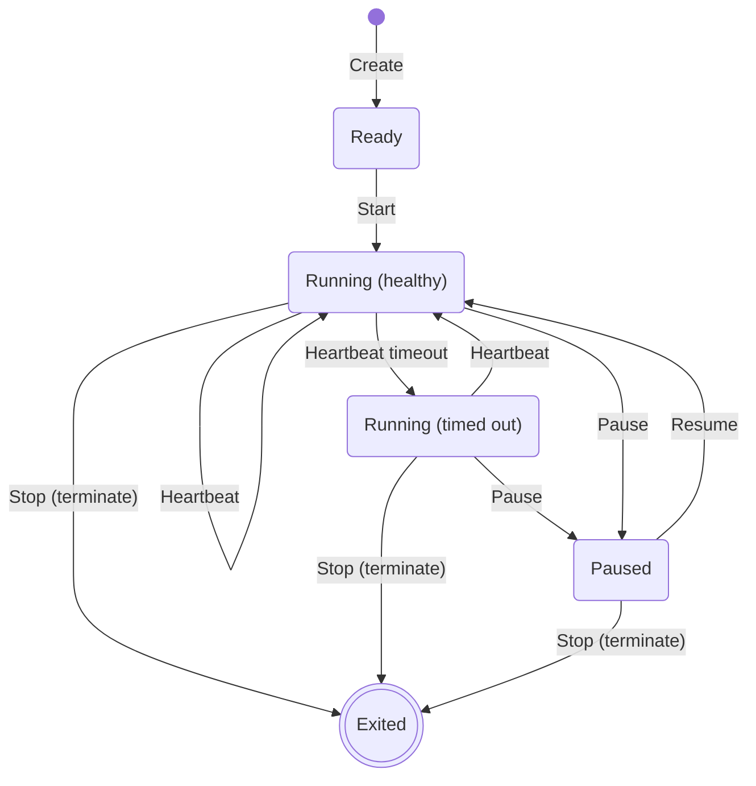

```mermaid
flowchart TB

start@{ shape: f-circ, label: "Junction" }
ready(Ready)
running_healthy("Running (healthy)")
running_timeout("Running (timed out)")
paused(Paused)
exited(((Exited)))

start -- Create --> ready
ready -- Start --> running_healthy

running_healthy -- Heartbeat --> running_healthy
running_healthy -- Heartbeat timeout --> running_timeout
running_timeout -- Heartbeat --> running_healthy

running_timeout -- Pause --> paused
running_healthy -- Pause --> paused
paused -- Resume --> running_healthy

running_healthy -- Stop (terminate) --> exited
running_timeout -- Stop (terminate) --> exited
paused -- Stop (terminate) --> exited
```
